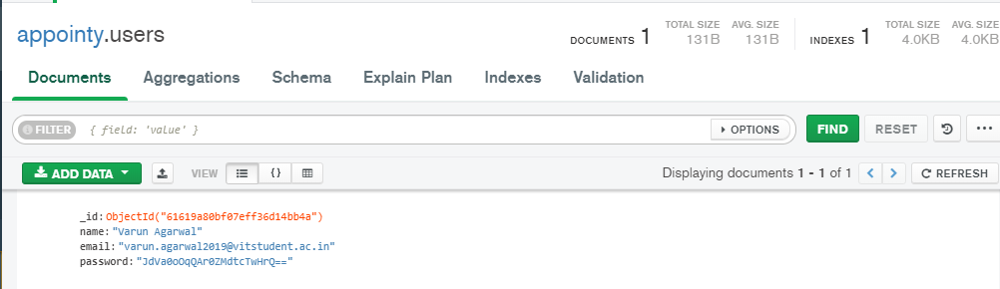

# Task  | Instagram Backend API

Submission for Appointy technical task for internship round 

## Usage

```bash
go run main.go
```
or
```bash
./main.exe
```
## APi End points
    1. POST /user
    with body like :
```json
{
    "name":"Varun Agarwal",
    "email": "varun.agarwal2019@vitstudent.ac.in",
    "password" : "12345678"
}
```

This will Store your user information to mongoDB with password encrypted with MD5

 

    2. GET /users/userId
This will Retrive your user information from mongoDB with password encrypted with MD5


    3. POST /posts
    with body like :
```json
{
    "caption":"Hello World this is my first Post" ,
    "imageUrl" : "instagram.com/1.png",
    "time" : "6:20 PM 09/10/2021",
    "userId" : "61619a80bf07eff36d14bb4a"
}
```
This will Store your post in mongoDB


    4. GET /posts/postId
This will Retrive your post information from mongoDB


    5. GET /posts/users/userId/(optional)PageNO
This will retrive all posts from a use with a given PageNO (Default is page 1) (posts per page is set to 5)

As shown below , there are 7 Sample posts by user Varun (userId : 61619a80bf07eff36d14bb4a) in the system.


As shown below , the first 5 were loaded in the get request with default parameters


And the remaining 2 were loaded when the PageNO was given as 2


## Other Features
    1. Passwords are securely stored such they can't be reverse engineered

    2. The server thread safe by locking and unlocking each function call to 1 single thread

    3. Pagination is used to list all the posts

## License
[MIT](https://choosealicense.com/licenses/mit/)